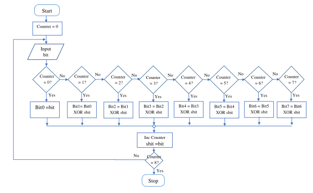

# Intel 8086 Yearly Calendar Program

This program, designed for the Intel 8086 processor, generates a yearly calendar based on user input. The user is prompted to enter any year, and the program then displays the calendar for the selected year.

## Usage

1. **Compile and Run the Program:**
    - The source code for the program is available in the attached folder.
    - Compile and run the program using an Intel 8086 emulator or assembler.

2. **User Input:**
    - The user is prompted to enter the desired year.

3. **Calendar Display:**
    - The program generates and displays the calendar for the entered year.

## Program Code

The program source code is provided in the [code folder](year_program/). You can find the complete Intel 8086 assembly program for the yearly calendar.

## Sample Output

## How to Run

- The program is designed to be run on an Intel 8086 emulator or assembler.
- Ensure the correctness of the entered year for accurate calendar generation.

# Guessing Game - Intel 8086 Assembly Program

This Intel 8086 assembly program implements a Guessing Game where the client is given five trials to guess a randomly selected word from a pool. If the guess is correct, 'Congratulations' is displayed, and a score is given depending on the trial number. An incorrect guess records a zero score for that particular attempt. Failure to have a correct guess over the trials results in a message 'Please try again,' and a new guess word is selected from the pool.

## Usage

1. **Compile and Run the Program:**
    - The source code for the program is available in the attached folder.
    - Compile and run the program using an Intel 8086 emulator or assembler.

2. **Guessing Game:**
    - The client is given five trials to guess a randomly selected word from the pool.

3. **Scoring:**
    - If the guess is correct, 'Congratulations' is displayed, and a score is given based on the trial number.
    - An incorrect guess records a zero score for that particular attempt.

4. **Retry:**
    - If there is no correct guess over the trials, 'Please try again' is displayed, and a new guess word is selected from the pool.

## Program Code

The program source code is provided in the [code file](guessing_game/). You can find the complete Intel 8086 assembly program for the Guessing Game.

## Sample Output

## How to Run

- The program is designed to be run on an Intel 8086 emulator or assembler.
- Ensure the correctness of the entered words in the pool for accurate game execution.

**Note:** Due to the length of the code, it has been placed in the attached folder for convenience.

# Intel 8086 Array Display Program

This Intel 8086 assembly program utilizes based indexed addressing mode to locate elements in a 10 by 10 array of characters. The user keys in the row and column values of any element location within the array. At a two-second interval, the character in that location is intermittently displayed on the Video Display Unit (VDU) with different colors. Keying 'New' allows the user to input new element locations, while 'S' halts the program, and the last display is relocated to location (0, 0) of the VDU.

## Description

1. The program allows users to enter the row and column of the element they want to be displayed on the VDU.
2. The system reads the entered values of row and column and stores them in memory.
3. To locate the element in the array, the program calculates the exact position of the element using the formula: 𝑃𝑜𝑠𝑖𝑡𝑖𝑜𝑛 𝑜𝑓 𝑒𝑙𝑒𝑚𝑒𝑛𝑡 = (𝑟𝑜𝑤 × 10) + 𝐶𝑜𝑙𝑢𝑚𝑛
4. The program obtains the address of the array in memory using the Load Effective Address (LEA) assembly address.
5. The value of the position calculated is used as the index for the based indexed addressing mode to address the desired element.
6. The retrieved element is displayed on the screen with different colors at intervals of 2 seconds.
7. An interrupt on the keyboard by the user prompts the user to enter either 'New' or 'S'. If 'New' is entered, the user is allowed to enter new values of row and column. If 'S' is entered, the program terminates.

## Flowchart

## Assembly Code

The assembly code for the program is provided in the [code folder](array_display_program/).

## Sample Running Program Window

## References

1. A.P Godse and D.A Godse, "Microprocessor and interfacing", First Edition: 2009

# Gray Code Shaft Encoder Assembler Program

This assembler program generates a gray code shaft encoder, giving the user the choice of 'Binary to Gray' or 'Gray to Binary'. The user keys in the input bits, and the program outputs the corresponding gray or binary value to a port of an Intel 8255 programmable Peripheral Interface (PPI).

The system is simulated using the Proteus environment with peripherals, including LEDs and a Liquid Crystal Display (LCD).

## Description

### Conversion of Gray to Binary

Let Gray Code be g3, g2, g1, g0. The respective Binary Code can be obtained using the XOR operation. The XOR logic table is as follows:

| A | B | Y |
|---|---|---|
| 1 | 1 | 0 |
| 1 | 0 | 1 |
| 0 | 1 | 1 |
| 0 | 0 | 0 |

### Conversion of Binary to Gray

Let Binary code be b3, b2, b1, b0. The respective Gray Code can be obtained as follows:

[Binary to Gray Conversion Figure]

In our solution, the program accepts 8 bits of either binary or gray code entered using the keypad by the user. The 8 bits are then converted, and the equivalent is stored and displayed on the LCD.

## Circuit Interface in Proteus

## Flowchart

### Gray Code to Binary Code Module

### Binary Code to Gray Code Module

### Overall Program Flow

## Sample Output Windows

## References

1. A.P Godse and D.A Godse, "Microprocessor and interfacing", First Edition: 2009
2. Lecture Notes
3. Emu8086 Documentation

# Up/Down Decimal Counter Assembly Program

This assembly language program implements an Up/Down decimal counter designed to run under the Intel 8086 microprocessor system. The program is intended for both emulator mode and the Proteus environment.

## Program Features

- **Counter Direction:** The counter can operate in both Up and Down directions.
- **Decimal Display:** The counter displays decimal values.
- **Emulator Mode:** The program is compatible with emulator mode for ease of testing and development.
- **Proteus Environment:** The program is compatible with the Proteus environment for circuit simulation.

## Circuit Interface in Proteus

## Program Execution

Specify how to execute the program in both emulator mode and the Proteus environment.

### Emulator Mode Execution

1. Open the emulator.
2. Load the program into the emulator.
3. Run the program.

### Proteus Environment Execution

1. Open the Proteus environment.
2. Load the circuit with the program.
3. Simulate the circuit to run the program.

## References

1. A.P Godse and D.A Godse, "Microprocessor and interfacing", First Edition: 2009
2. Lecture Notes
3. Emu8086 Documentation

